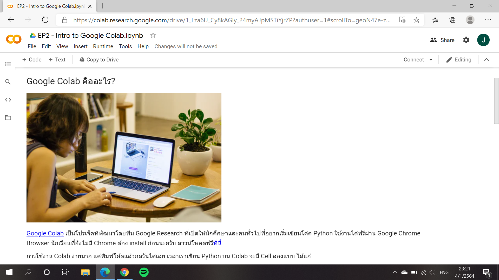
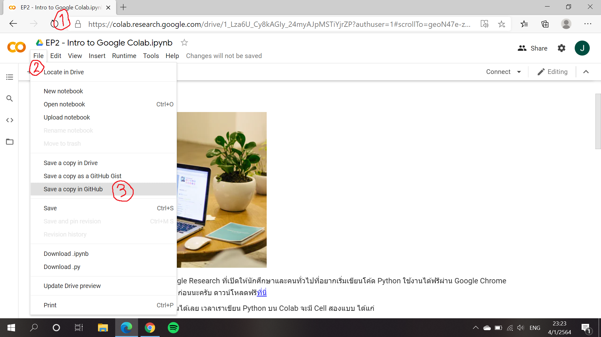
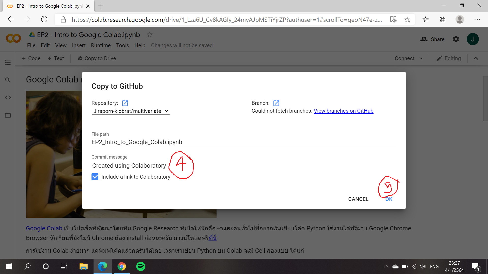

# multivariate

### จิราพร  ID 623020762-6

.md => Markdown

[] square brackets

( ) parentheses

อธิบายการใช้งาน Github  และ Google colab ว่าหน้าที่ของแต่ละอันคืออะไร และอธิบายวิธีเซฟไฟล์จาก Google colab ลงไปใน Github

การใช้งาน Github คือ การสร้างงานผ่านเว็ปไซต์โดยใช้งานร่วมกับคนอื่นและพัฒนาร่วมกันได้ โดยที่คนอื่นสามารถเข้ามาแก้ไขงานของเราได้ และสามารถระบุได้ว่าเราททำงานถึงส่วนไหนแล้ว

การใช้งาน Google colab คือ สามารถเขียน Python บน Google colab ได้ โดยจะมีอยู่ 2 cell คือ 1.code 2.text ซึ่งเราสามารถพิมพ์โค้ดหรือเพิ่มข้อความบน Google Colab ได้

วิธีเซฟไฟล์จาก Google colab ลงไปใน Github คือ 
1.เข้าไปใน Google colab
2.คลิก File
3.เลือก Save a copy in Github จากนั้นเลือกงานที่ต้องการ
4.ใส่ commit messege ซึ่งจะบอกว่า version นี้คืออะไร
5.กด OK
